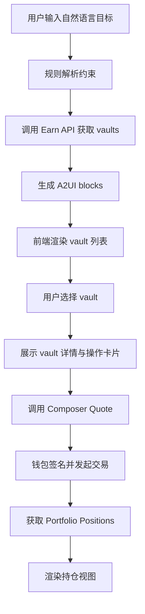

# Mullet Guide 项目文档

## 1. 项目定位

### 1.1 项目名称

Mullet Guide — AI-powered A2UI DeFi Yield Assistant

### 1.2 一句话描述

用户通过自然语言描述收益目标，系统以 A2UI 方式逐步生成界面，引导用户发现合适的 DeFi 收益 vault，并完成链上存款与持仓查看。

### 1.3 黑客松目标

在最短时间内完成一个可演示、可交互、可发起真实交易的 MVP，而不是构建复杂的全自动 Agent。

## 2. 产品目标

用户示例输入：

```text
invest 100 USDC safely on Base
```

系统需要完成：

1. 解析用户约束：资产、链、金额、风险偏好。
2. 调用 LI.FI Earn Data API 获取 vault 列表并筛选。
3. 解释推荐理由：APY、协议、TVL、风险因素。
4. 让用户选择目标 vault。
5. 调用 LI.FI Composer API 生成交易 quote。
6. 通过钱包执行 deposit。
7. 获取并展示最新 portfolio positions。

## 3. MVP 范围

### 3.1 包含内容

- 单页式引导流程
- 自然语言目标输入
- 基于规则的轻量解析
- Vault 列表推荐
- Vault 详情解释
- Deposit 操作卡片
- 钱包连接与交易发起
- 持仓展示

### 3.2 不包含内容

- 复杂多轮推理 Agent
- 个性化用户画像系统
- 历史收益分析图表
- 自建数据库
- 后台管理系统

## 4. 核心设计原则

1. 工作流优先：必须先打通主链路，再优化 UI。
2. 真接口优先：尽量使用真实 Earn / Composer / Portfolio 接口，不依赖 mock。
3. 轻后端：仅在保护 Composer API Key 时使用 Next.js Route Handler 代理。
4. 可解释性优先：每个推荐都要说明为什么被推荐。
5. A2UI 而非静态页面：前端通过 schema 驱动渲染，而不是为每一步硬编码页面。

## 5. 用户流程



## 6. 技术架构

## 6.1 技术栈

- 框架：Next.js 15+（App Router）
- 语言：TypeScript
- UI：React + TailwindCSS
- 钱包：wagmi + RainbowKit
- 数据请求：原生 `fetch` 或 `axios`
- 状态管理：React hooks / `zustand` 二选一，MVP 推荐 React hooks

## 6.2 架构说明

### 前端职责

- 接收用户输入
- 调用规则解析逻辑
- 获取 vault 数据
- 将业务结果转换为 A2UI JSON blocks
- 根据 schema 渲染 UI
- 连接钱包并执行交易
- 展示 portfolio

### 轻服务端职责

仅提供一个最小代理层，用于：

- 代理 Composer `/v1/quote`
- 注入 LI.FI API Key
- 避免 API Key 暴露到浏览器

这部分仍然放在同一个 Next.js 项目内，不引入独立后端服务。

## 7. 外部 API 集成设计

## 7.1 Earn Data API

基础地址：

```text
https://earn.li.fi
```

必接接口：

```text
GET /v1/earn/vaults
GET /v1/earn/portfolio/:address/positions
```

用途：

- `/v1/earn/vaults`：获取全部 vault 数据，前端或服务端做过滤与排序。
- `/v1/earn/portfolio/:address/positions`：交易完成后刷新用户持仓。

## 7.2 Composer API

基础地址：

```text
https://li.quest
```

必接接口：

```text
GET /v1/quote
```

关键要求：

- 必须使用 `GET`
- 必须带 API Key
- `toToken = vault.address`

## 7.3 必须处理的接口边界

### `apy` 可能为 `null`

处理原则：

- UI 中展示为“APY 暂无数据”
- 排序时将 `null` 视为最低优先级
- 解释文案中明确说明“收益率数据暂缺，不作为主推荐依据”

### `tvl` 为字符串

处理原则：

- 不直接假设为 number
- 渲染前显式转换为 `Number(tvl)`
- 大数格式化时使用安全格式化函数

### 代币精度不一致

处理原则：

- 用户输入的金额需要根据 `fromToken.decimals` 转成最小单位
- `USDC` 默认 6 位，不可按 18 位处理
- quote 前必须使用 token 元数据进行单位换算

## 8. 规则解析策略

MVP 不使用复杂 Agent，仅使用轻量规则解析。

## 8.1 需要解析的字段

- `amount`
- `asset`
- `chain`
- `riskPreference`

## 8.2 规则样例

- 出现 `100`、`500`、`1000` 等数字时解析为金额
- 出现 `USDC`、`USDT`、`ETH` 等符号时解析为资产
- 出现 `Base`、`Arbitrum`、`Ethereum` 时解析为链
- 出现 `safe`、`safely`、`稳健`、`安全` 时解析为低风险偏好

## 8.3 默认值策略

- 未识别资产：默认 `USDC`
- 未识别链：默认 `Base`
- 未识别金额：默认 `100`
- 未识别风险：默认 `moderate`

## 8.4 风险偏好映射

- `safe` / `安全`：优先稳定币、较高 TVL、主流协议
- `moderate` / `平衡`：允许主流资产收益策略
- `aggressive` / `激进`：可接受更高 APY 和更波动的资产

## 9. Vault 筛选与推荐策略

## 9.1 基础过滤

- 资产匹配：优先支持用户指定资产的 vault
- 链匹配：仅保留目标链 vault
- 可用状态校验：剔除不可交互 vault

## 9.2 推荐排序

MVP 推荐使用简单权重排序：

```text
综合分 = 资产匹配 + 链匹配 + 风险适配 + APY 分 + TVL 分
```

建议规则：

- 低风险偏好时，提高 TVL 权重
- `apy = null` 时不给 APY 分，但不直接剔除
- 稳定币 vault 可获得低风险加分

## 9.3 推荐理由生成

推荐理由应由规则拼装，不依赖 LLM：

- “该 vault 位于 Base，符合你的目标链偏好”
- “底层资产为 USDC，更贴近稳健型收益需求”
- “TVL 较高，通常代表更高的流动性与使用规模”
- “APY 为 X%，在当前筛选结果中处于前列”

## 10. A2UI Schema 设计

## 10.1 Block 基础结构

```json
{
  "type": "constraint_card",
  "data": {}
}
```

## 10.2 支持的 Block 类型

### `constraint_card`

用途：展示解析后的用户约束

```json
{
  "type": "constraint_card",
  "data": {
    "asset": "USDC",
    "chain": "Base",
    "amount": "100",
    "riskPreference": "safe"
  }
}
```

### `vault_list`

用途：展示推荐 vault 列表

```json
{
  "type": "vault_list",
  "data": {
    "title": "推荐金库",
    "items": [
      {
        "id": "vault-1",
        "name": "USDC Stable Vault",
        "protocol": "Protocol X",
        "apy": 5.23,
        "tvl": "1293845.22",
        "tags": ["Base", "USDC", "Stable"],
        "selectable": true
      }
    ]
  }
}
```

### `vault_detail`

用途：解释单个 vault 的关键细节

```json
{
  "type": "vault_detail",
  "data": {
    "name": "USDC Stable Vault",
    "protocol": "Protocol X",
    "apy": {
      "total": 5.23,
      "base": 3.8,
      "reward": 1.43
    },
    "tvl": "1293845.22",
    "whyRecommended": [
      "资产与目标一致",
      "链与目标一致",
      "TVL 较高，偏稳健",
      "APY 在候选中较优"
    ],
    "protocolInfo": "主流稳定币收益策略"
  }
}
```

### `action_card`

用途：展示存款动作与 quote 结果

```json
{
  "type": "action_card",
  "data": {
    "vaultId": "vault-1",
    "depositToken": "USDC",
    "depositAmount": "100",
    "estimatedOutput": "99.82",
    "buttonText": "存入该 Vault",
    "quoteReady": true
  }
}
```

### `portfolio_view`

用途：展示用户最新持仓

```json
{
  "type": "portfolio_view",
  "data": {
    "address": "0x1234...",
    "positions": [
      {
        "protocol": "Protocol X",
        "asset": "USDC",
        "chain": "Base",
        "amountUsd": 100.42,
        "apy": 5.23
      }
    ]
  }
}
```

## 10.3 Demo 输出示例

用户输入：

```text
invest 100 USDC safely on Base
```

推荐阶段可返回：

```json
[
  {
    "type": "constraint_card",
    "data": {
      "asset": "USDC",
      "chain": "Base",
      "amount": "100",
      "riskPreference": "safe"
    }
  },
  {
    "type": "vault_list",
    "data": {
      "title": "适合你的稳健型收益 Vault",
      "items": [
        {
          "id": "base-usdc-1",
          "name": "Base USDC Vault",
          "protocol": "Example Protocol",
          "apy": 5.1,
          "tvl": "2400000.00",
          "tags": ["Base", "USDC", "Safe"],
          "selectable": true
        }
      ]
    }
  }
]
```

选中 vault 后可追加返回：

```json
[
  {
    "type": "vault_detail",
    "data": {
      "name": "Base USDC Vault",
      "protocol": "Example Protocol",
      "apy": {
        "total": 5.1,
        "base": 4.0,
        "reward": 1.1
      },
      "tvl": "2400000.00",
      "whyRecommended": [
        "Base 链符合你的输入",
        "USDC 适合稳健型配置",
        "TVL 较高，流动性更充足"
      ],
      "protocolInfo": "主流稳定币收益产品"
    }
  },
  {
    "type": "action_card",
    "data": {
      "vaultId": "base-usdc-1",
      "depositToken": "USDC",
      "depositAmount": "100",
      "estimatedOutput": "99.75",
      "buttonText": "立即存入",
      "quoteReady": true
    }
  }
]
```

## 11. 建议项目结构

```text
mullet-guide/
├─ app/
│  ├─ api/
│  │  └─ quote/
│  │     └─ route.ts
│  ├─ globals.css
│  ├─ layout.tsx
│  └─ page.tsx
├─ components/
│  ├─ blocks/
│  │  ├─ action-card.tsx
│  │  ├─ constraint-card.tsx
│  │  ├─ portfolio-view.tsx
│  │  ├─ vault-detail.tsx
│  │  └─ vault-list.tsx
│  ├─ renderer/
│  │  └─ block-renderer.tsx
│  └─ wallet/
│     └─ wallet-provider.tsx
├─ lib/
│  ├─ agent/
│  │  ├─ build-blocks.ts
│  │  └─ parse-goal.ts
│  ├─ api/
│  │  ├─ composer.ts
│  │  ├─ earn.ts
│  │  └─ portfolio.ts
│  ├─ constants/
│  │  ├─ chains.ts
│  │  └─ tokens.ts
│  ├─ format/
│  │  ├─ amount.ts
│  │  └─ number.ts
│  ├─ quote/
│  │  └─ build-quote-params.ts
│  ├─ types/
│  │  ├─ a2ui.ts
│  │  ├─ earn.ts
│  │  └─ quote.ts
│  └─ vaults/
│     ├─ filter-vaults.ts
│     └─ rank-vaults.ts
├─ public/
├─ docs/
│  ├─ project-doc.md
│  └─ progress-plan.md
├─ .env.example
├─ package.json
├─ tailwind.config.ts
├─ tsconfig.json
└─ README.md
```

## 12. 关键文件职责

### `lib/api/earn.ts`

- 请求 `GET /v1/earn/vaults`
- 请求 `GET /v1/earn/portfolio/:address/positions`
- 统一处理响应格式与异常

### `lib/api/composer.ts`

- 封装 Composer quote 请求
- 保证使用 `GET`
- 保证 `toToken = vault.address`

### `lib/agent/parse-goal.ts`

- 将自然语言解析为结构化约束
- 使用规则匹配与默认值兜底

### `lib/agent/build-blocks.ts`

- 将业务数据转换为 A2UI blocks
- 保证前端渲染与业务逻辑解耦

### `components/renderer/block-renderer.tsx`

- 根据 `type` 动态渲染 block 组件
- 是 A2UI 前端机制的核心

### `app/api/quote/route.ts`

- 作为轻量服务端代理
- 从环境变量读取 LI.FI API Key
- 转发 quote 请求

## 13. 数据模型建议

## 13.1 用户约束模型

```ts
export type UserConstraints = {
  rawInput: string;
  amount: string;
  asset: string;
  chain: string;
  riskPreference: "safe" | "moderate" | "aggressive";
};
```

## 13.2 A2UI Block 模型

```ts
export type A2UIBlock =
  | { type: "constraint_card"; data: ConstraintCardData }
  | { type: "vault_list"; data: VaultListData }
  | { type: "vault_detail"; data: VaultDetailData }
  | { type: "action_card"; data: ActionCardData }
  | { type: "portfolio_view"; data: PortfolioViewData };
```

## 13.3 Vault 归一化模型

```ts
export type NormalizedVault = {
  id: string;
  name: string;
  protocol: string;
  chain: string;
  assetSymbol: string;
  vaultAddress: string;
  apy: number | null;
  apyBase?: number | null;
  apyReward?: number | null;
  tvl: number | null;
  tags: string[];
  score: number;
};
```

## 14. 交易流程设计

## 14.1 Quote 生成

用户确认某个 vault 后：

1. 读取用户钱包地址
2. 将输入金额转为最小单位
3. 构造 quote 参数
4. 请求内部 `/api/quote`
5. 获取可执行交易数据

关键字段要求：

- `fromToken`：用户存入资产地址
- `toToken`：目标 `vault.address`
- `fromAmount`：最小单位金额字符串
- `fromChain` / `toChain`：链 ID
- 请求方法：`GET`

## 14.2 钱包执行

- 使用 wagmi 连接钱包
- 使用 quote 返回的交易参数发起写链操作
- 交易成功后刷新 portfolio

## 15. 环境变量设计

建议创建 `.env.local`：

```bash
NEXT_PUBLIC_WALLETCONNECT_PROJECT_ID=your_walletconnect_project_id
LIFI_API_KEY=your_lifi_api_key
```

说明：

- `LIFI_API_KEY` 仅服务端使用，不暴露到客户端
- `NEXT_PUBLIC_` 前缀变量可暴露到浏览器

## 16. UI 设计原则

- 页面结构保持单列主流程，减少跳转
- 每一步只展示当前最相关信息
- 推荐结果优先展示 3 个以内 vault
- 所有关键数字都要格式化展示
- APY 缺失时不要显示异常占位符或 NaN
- CTA 只保留一个主按钮，避免用户分心

## 17. 验收标准

满足以下条件即可视为 MVP 完成：

1. 用户输入自然语言后能看到已解析约束。
2. 系统能从 Earn API 返回 vault 列表并完成筛选。
3. 前端不是静态页面，而是根据 schema 渲染 block。
4. 用户可以选择 vault 并看到推荐解释。
5. 系统能通过 Composer `GET /v1/quote` 生成真实 quote。
6. 用户能连接钱包并发起交易。
7. 交易完成后能查看 portfolio positions。

## 18. 风险与应对

### 风险 1：Composer 参数不确定

应对：

- 先以最小可用参数集打通 quote
- 封装统一参数构造函数，避免散落在 UI 层

### 风险 2：Vault 数据字段不稳定

应对：

- 先做归一化层
- 所有可空字段在进入 UI 前完成兜底

### 风险 3：钱包交易在 Demo 环节失败

应对：

- 预先准备可用测试钱包与资产
- 保留 quote 预览状态，必要时先展示可执行交易数据

### 风险 4：A2UI 实现过重

应对：

- 仅保留 5 类 block
- 使用 `type -> component` 的简单映射，不做运行时 DSL 扩展

## 19. 后续扩展方向

- 增加更多链与资产识别
- 增加更细粒度的风险问答
- 增加历史收益与 portfolio 变化趋势
- 增加用户偏好记忆
- 增加多 vault 对比视图
